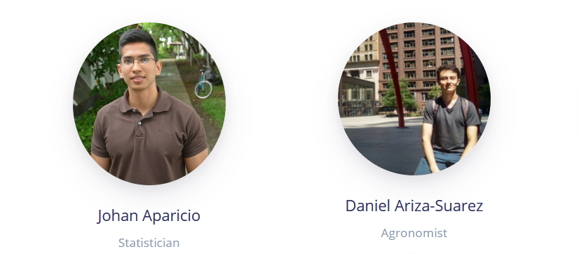

<link href="images/style.css" rel="stylesheet"></link>

# Starting with MrBean 

https://apariciojohan.github.io/Starting_MrBean/

## Installation

You can install MrBean:

``` r
devtools::install_github("AparicioJohan/MrBeanApp")       
remotes::install_github("AparicioJohan/MrBeanApp")   
```
or you can go to https://mrpackages.netlify.app/mrbean.html and donwload it from there.

```r
file <- rstudioapi::selectFile()
remotes::install_local(  file )
```

## Example

``` r
library(MrBean)
run_app()
```




