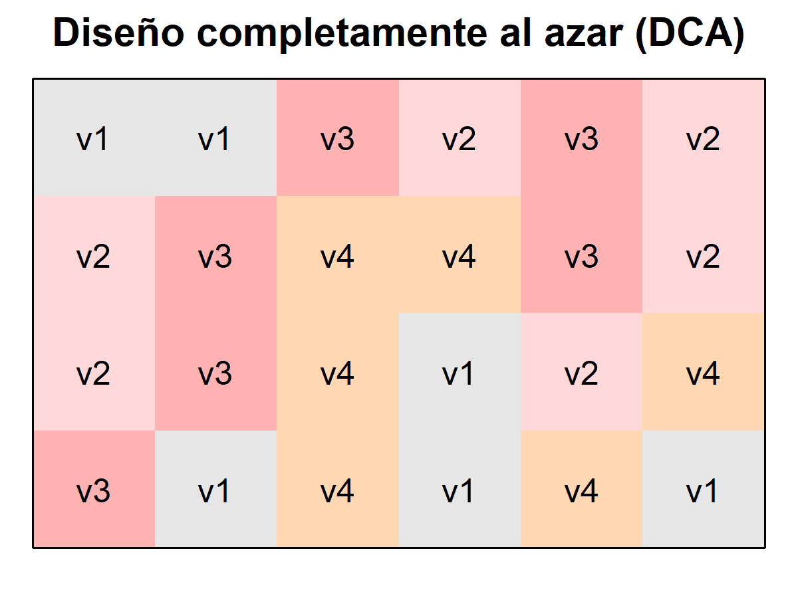
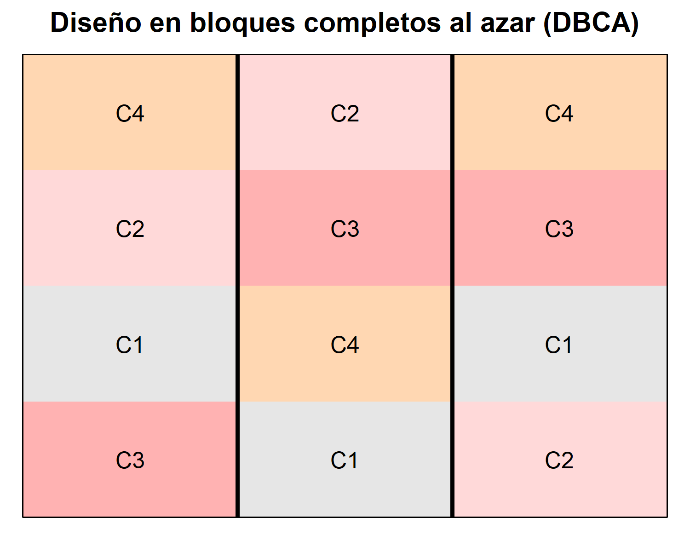
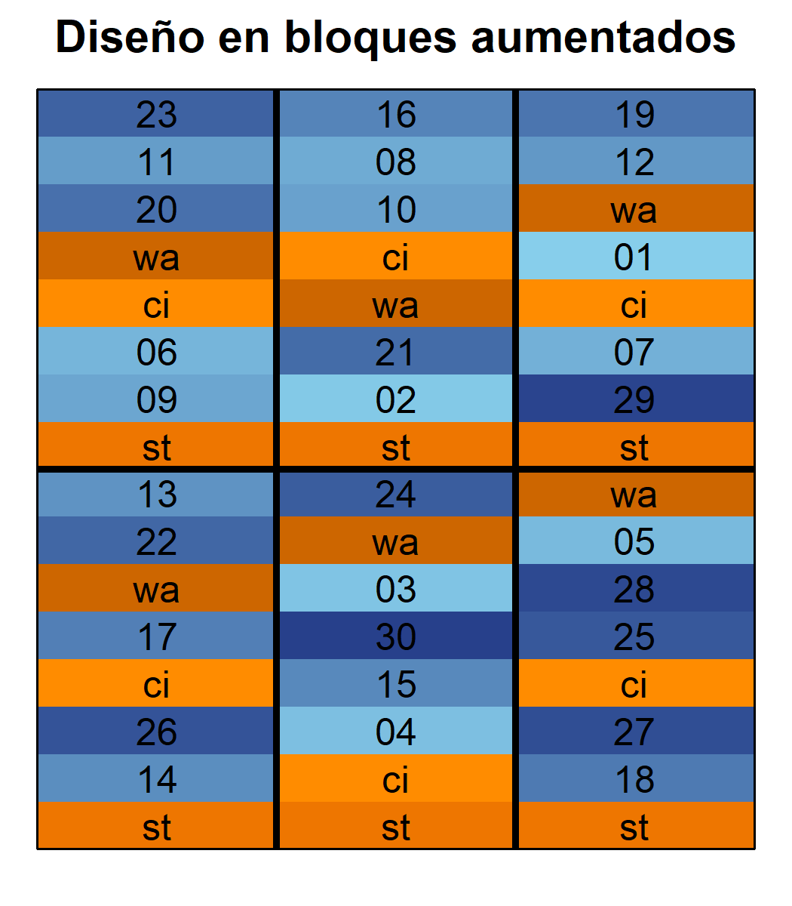
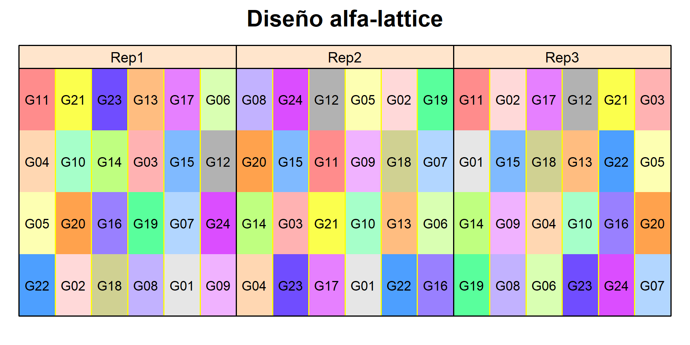
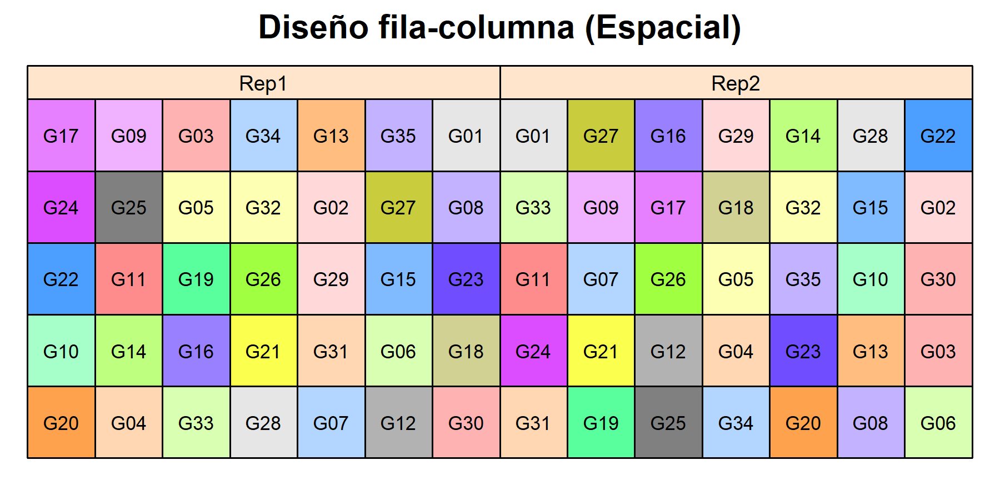

A continuación encontrará datos de ejemplo que servirán para introducir algunos diseños experimentales en agricultura. Los datos fueron tomados de materiales de cursos del Profesor [Dr. Hans-Peter Piepho](https://www.uni-hohenheim.de/organisation?tx_base_lsfcontentadmin%5BlsfPerson%5D=6257&L=1).

 

### 1. Diseño completamente al azar (DCA)

<a href="data/CRD.csv" download="CRD"> Download CRD </a>

### 2. Diseño en bloques completos al azar (DBCA)

<a href="data/RCBD.csv" download="RCBD"> Download RCBD </a>

### 3. Diseño en bloques aumentados

<a href="data/Augmented.csv" download="Augmented"> Download Augmented_1 </a>

<a href="data/Augmented_2.csv" download="Augmented2"> Download Augmented_2 </a>

### 4. Diseño alfa-lattice

<a href="data/Alpha.csv" download="Alpha"> Download Alpha-lattice </a>

### 5. Diseño fila-columna (Espacial)

<a href="data/row_col.csv" download="row_col"> Download Row-Col </a>

 