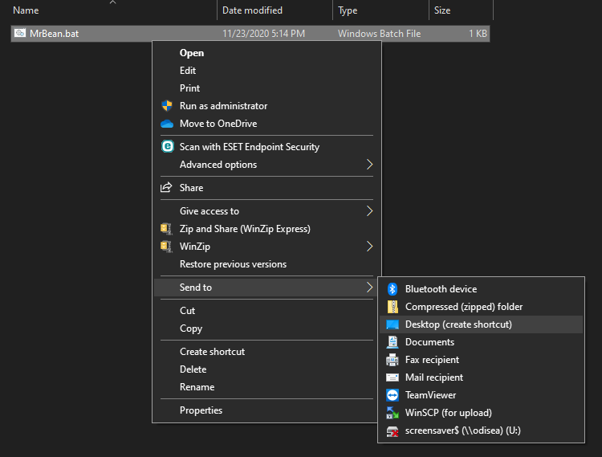

  
  
  
```{r setup, include=FALSE}
knitr::opts_chunk$set(echo = TRUE, cache = TRUE)
```

# Después de instalar `MrBean`, puede crear un acceso directo para que sea más fácil iniciar el software.

Los siguientes pasos se deben llevar a cabo una única vez para crear un acceso directo a `MrBean`.
Posteriormente, podrá acceder al software utilizando únicamente el acceso directo, como cualquier otro programa de escritorio.

Por favor, abra la consola de R, copie, pegue y ejecute el siguiente comando:
  
```{r eval=FALSE}
writeLines( c("@echo off",
              paste0('start /min "Running MrBean" "',
                     paste0(R.home(), '/bin/Rscript'),
                     '" -e "library(MrBean) ; run_app() ; quit(save = FALSE)" ')),
            con = paste0( file.path(choose.dir(), '/MrBean.bat' ) ) )
```
Al ejecutarlo, se desplegará la siguiente ventana. En ella, debe seleccionar la carpeta en donde desea guardar el archivo ejecutable de `MrBean`.


Posteriormente, el archivo "MrBean.bat" se habrá creado en la carpeta seleccionada. Este archivo ejecutable le dará acceso directo al programa `MrBean` al hacer doble click en él.

Adicionalmente, puede llevar este acceso directo al escritorio de su computadora con Windows:
  



Finalmente puedes añadir el icono de `MrBean` a tu acceso directo para que identifiques mejor la app.

<a href="images/logo.png" download = "logo"></a>

> Dar click sobre la imagen para descargar.
