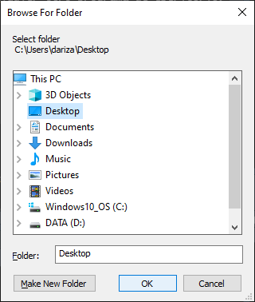

  
  
  


# Después de instalar `MrBean`, puede crear un acceso directo para que sea más fácil iniciar el software.

Los siguientes pasos se deben llevar a cabo una única vez para crear un acceso directo a `MrBean`.
Posteriormente, podrá acceder al software utilizando únicamente el acceso directo, como cualquier otro programa de escritorio.

Por favor, abra la consola de R, copie, pegue y ejecute el siguiente comando:
  

```r
source('https://raw.githubusercontent.com/AparicioJohan/Starting_MrBean/main/docs/create_MrBean_shorcut.R')
```
Al ejecutarlo, se desplegará la siguiente ventana. En ella, debe seleccionar la carpeta en donde desea guardar el archivo ejecutable de `MrBean`.





Finalmente, ya podrá cerrar `R` y dirigirse directamente a la ruta que eligió en el paso anterior. Desde allí podrá dar doble click sobre el logo de `MrBean` el cuál, después de unos segundos, abrirá la app en el navegador.
