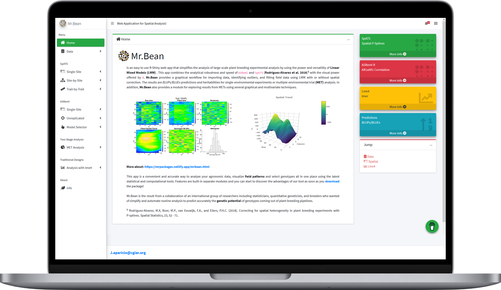

----

# Iniciando con MrBean

<div class="row">
<div class="card">
<a href="#" target="_blank"></a>
</div>
</div>

## Instalación

Primero debes instalar la librería `devtools` o `remotes`, para esto debemos seguir los siguientes comandos:


<div class = "row"> <div class = "col-md-6">
```r
install.packages("devtools")   
```
</div> <div class = "col-md-6">
```r
install.packages("remotes")
```
</div> </div>


Posteriormente para instalar `MrBean` sigue uno de los siguientes comandos:

``` r
devtools::install_github("AparicioJohan/MrBeanApp")       
remotes::install_github("AparicioJohan/MrBeanApp")   
```
También puedes ir a la página web https://mrpackages.netlify.app/mrbean.html y descargar el paquete comprimido.

```r
file <- rstudioapi::selectFile()
remotes::install_local(  file )
```

## Cargando `MrBean`

``` r
library(MrBean)
run_app()
```


