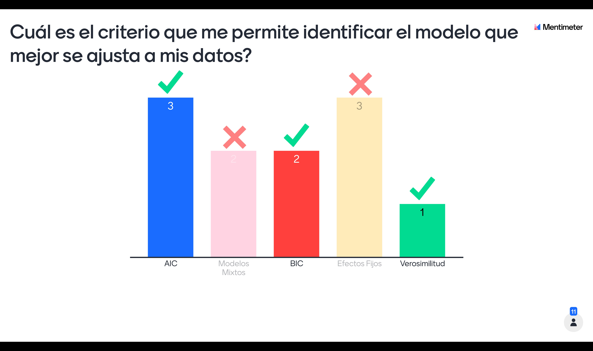
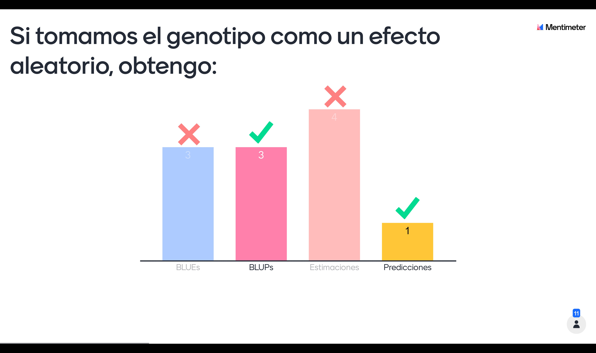
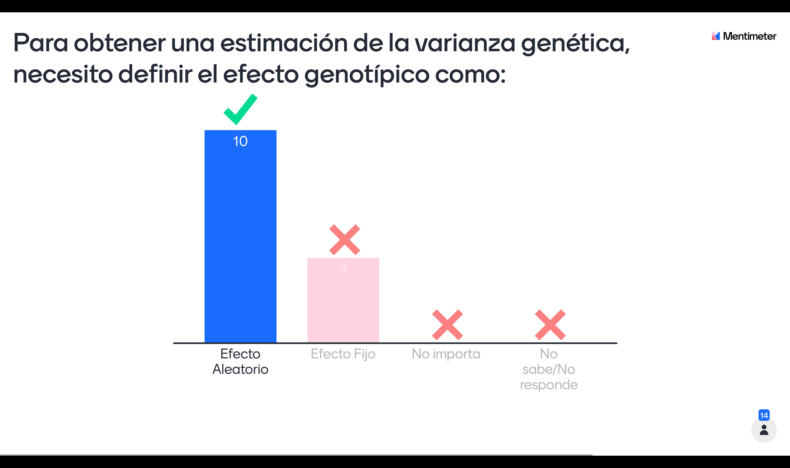
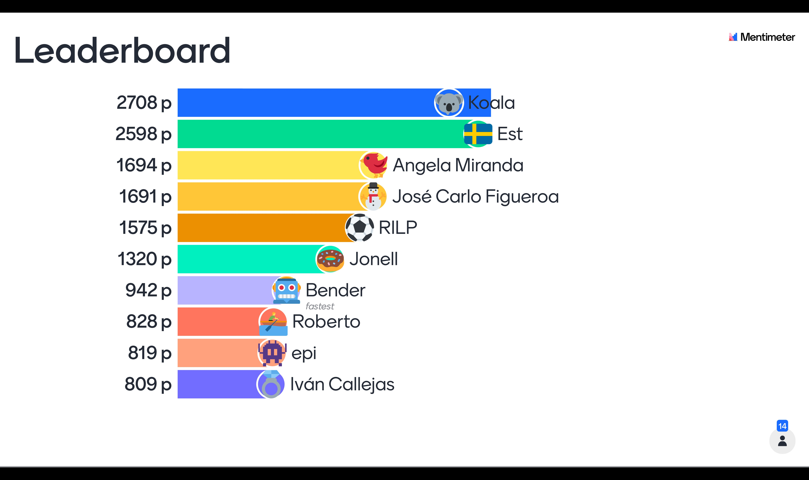

  
  
---

# Presentación 3

<a href="sessions/sesion_3.pdf" download="sesion_3"> Descargar Sesión 3 </a>

# Información Adicional

* [¿Qué significa la normalidad?](https://doi.org/10.1111/jac.12220)
* [Primer reporte MrBean](https://www.mdpi.com/1422-0067/21/9/3361/htm)

# Resultados Encuesta

 

 
  
  

  